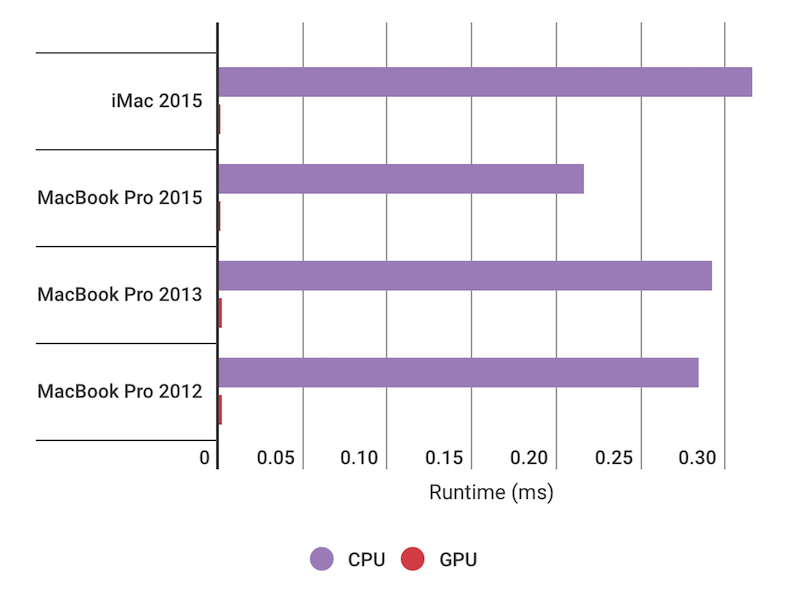

# OpenCL Performance Test

This is a simple test to compare the performance between CPU and GPU computation.

There are two program `cpu.c` and `gpu.c`, both of them will calculate the summary of numbers from `0` to `100 million`. In the end, the program will display the elapsed time.

## How to run

First, you need to compile the programs. This method only works on Apple platform (macOS) for now.

Type the following command to your terminal:

```
make
```

When the compiling finished, you will have 2 binary files: `cpu` and `gpu`.

Run test on CPU:

```
./cpu
```

Run test on GPU:

```
./gpu
```

## What's your test result?

### iMac Late 2015
I ran the test on an iMac Late 2015, which has:

```
CPU: 1.6 GHz Intel Core i5
GPU: 1535 MB Intel HD Graphics 6000
```

The runtime result is:

```
CPU: 0.315500ms
GPU: 0.000862ms
```

### MacBook Pro Mid 2015

Another test on MacBook Pro Mid 2015:

```
CPU: 2.5 GHz Intel Core i7
GPU: 1536 MB Intel Iris Pro
```

Runtime result:

```
CPU: 0.216143ms
GPU: 0.000545ms
```

### MacBook Pro Late 2013

On MacBook Pro Late 2013:

```
CPU: 2.4 GHz Intel Core i5
GPU: 1536 Intel Iris
```

Runtime result:

```
CPU: 0.291636ms
GPU: 0.001999ms
```

### MacBook Pro Mid 2012

On MacBook Pro Mid 2012:

```
CPU: 2.5 GHz Intel Core i5
GPU: 1536 MB Intel HD Graphics 4000
```

Runtime result:

```
CPU: 0.284128ms
GPU: 0.001589ms
```


